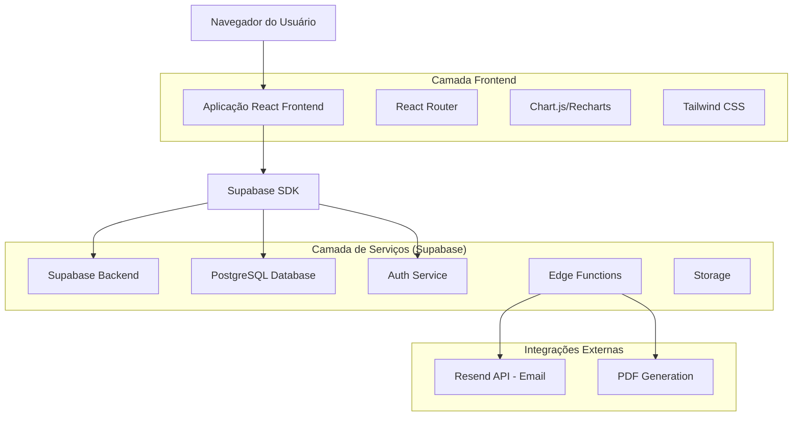
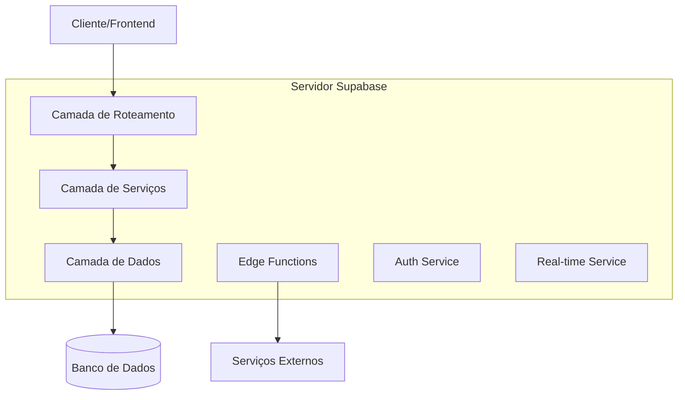
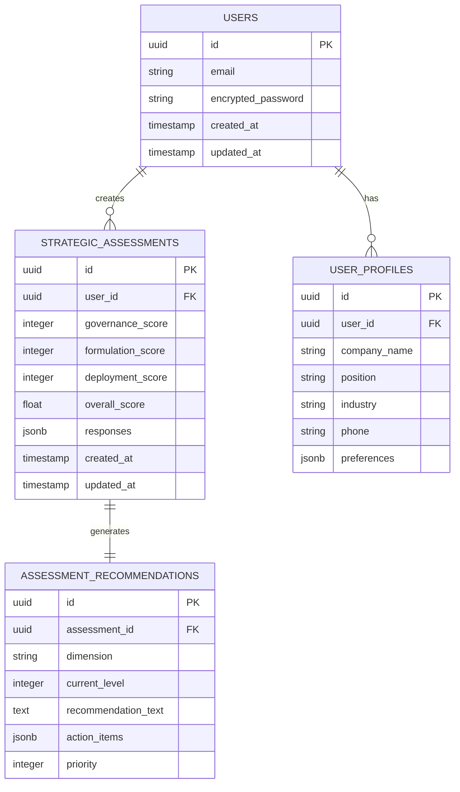

# Ferramenta de Assessment de Maturidade da Gestão da Estratégia - Documentação de Arquitetura Técnica

## 1. Arquitetura do Sistema



## 2. Descrição das Tecnologias

* **Frontend**: React\@18 + TypeScript + Tailwind CSS\@3 + Vite

* **Backend**: Supabase (PostgreSQL + Edge Functions)

* **Autenticação**: Supabase Auth

* **Visualização**: Chart.js ou Recharts para gráficos

* **Email**: Resend API para envio de relatórios

* **PDF**: jsPDF ou Puppeteer para geração de relatórios

## 3. Definições de Rotas

| Rota         | Propósito                                     |
| ------------ | --------------------------------------------- |
| /            | Página inicial com apresentação da ferramenta |
| /login       | Página de autenticação de usuários            |
| /register    | Página de registro com dados organizacionais  |
| /assessment  | Questionário interativo de avaliação          |
| /results/:id | Relatório de resultados específico            |
| /history     | Histórico de assessments do usuário           |
| /profile     | Perfil e configurações do usuário             |
| /admin       | Dashboard administrativo (acesso restrito)    |

## 4. Definições de API

### 4.1 APIs Principais

**Autenticação de usuários**

```
POST /auth/v1/signup
```

Request:

| Parâmetro     | Tipo   | Obrigatório | Descrição                    |
| ------------- | ------ | ----------- | ---------------------------- |
| email         | string | true        | Email corporativo do usuário |
| password      | string | true        | Senha (mínimo 8 caracteres)  |
| company\_name | string | true        | Nome da empresa              |
| position      | string | true        | Cargo do usuário             |
| industry      | string | false       | Setor de atuação             |

Response:

| Parâmetro | Tipo   | Descrição               |
| --------- | ------ | ----------------------- |
| user      | object | Dados do usuário criado |
| session   | object | Token de sessão         |

**Submissão de Assessment**

```
POST /rest/v1/strategic_assessments
```

Request:

| Parâmetro          | Tipo    | Obrigatório | Descrição                             |
| ------------------ | ------- | ----------- | ------------------------------------- |
| user\_id           | uuid    | true        | ID do usuário                         |
| governance\_score  | integer | true        | Score da dimensão Governança (1-4)    |
| formulation\_score | integer | true        | Score da dimensão Formulação (1-4)    |
| deployment\_score  | integer | true        | Score da dimensão Desdobramento (1-4) |
| responses          | jsonb   | true        | Respostas detalhadas do questionário  |

Response:

| Parâmetro       | Tipo  | Descrição                             |
| --------------- | ----- | ------------------------------------- |
| id              | uuid  | ID único do assessment                |
| overall\_score  | float | Score geral calculado                 |
| recommendations | array | Lista de recomendações personalizadas |

**Geração de Relatório PDF**

```
POST /functions/v1/generate-strategic-report
```

Request:

| Parâmetro                | Tipo    | Obrigatório | Descrição                        |
| ------------------------ | ------- | ----------- | -------------------------------- |
| assessment\_id           | uuid    | true        | ID do assessment                 |
| include\_recommendations | boolean | false       | Incluir recomendações detalhadas |

Response:

| Parâmetro   | Tipo      | Descrição                           |
| ----------- | --------- | ----------------------------------- |
| pdf\_url    | string    | URL temporária para download do PDF |
| expires\_at | timestamp | Data de expiração do link           |

## 5. Arquitetura do Servidor



## 6. Modelo de Dados

### 6.1 Definição do Modelo de Dados



### 6.2 Linguagem de Definição de Dados (DDL)

**Tabela de Perfis de Usuário (user\_profiles)**

```sql
-- Criar tabela
CREATE TABLE user_profiles (
    id UUID PRIMARY KEY DEFAULT gen_random_uuid(),
    user_id UUID REFERENCES auth.users(id) ON DELETE CASCADE,
    company_name VARCHAR(255) NOT NULL,
    position VARCHAR(255) NOT NULL,
    industry VARCHAR(100),
    phone VARCHAR(20),
    preferences JSONB DEFAULT '{}',
    created_at TIMESTAMP WITH TIME ZONE DEFAULT NOW(),
    updated_at TIMESTAMP WITH TIME ZONE DEFAULT NOW()
);

-- Criar índices
CREATE INDEX idx_user_profiles_user_id ON user_profiles(user_id);
CREATE INDEX idx_user_profiles_company ON user_profiles(company_name);
CREATE INDEX idx_user_profiles_industry ON user_profiles(industry);

-- Políticas RLS
ALTER TABLE user_profiles ENABLE ROW LEVEL SECURITY;

CREATE POLICY "Users can view own profile" ON user_profiles
    FOR SELECT USING (auth.uid() = user_id);

CREATE POLICY "Users can update own profile" ON user_profiles
    FOR UPDATE USING (auth.uid() = user_id);

CREATE POLICY "Users can insert own profile" ON user_profiles
    FOR INSERT WITH CHECK (auth.uid() = user_id);
```

**Tabela de Assessments Estratégicos (strategic\_assessments)**

```sql
-- Criar tabela
CREATE TABLE strategic_assessments (
    id UUID PRIMARY KEY DEFAULT gen_random_uuid(),
    user_id UUID REFERENCES auth.users(id) ON DELETE CASCADE,
    governance_score INTEGER CHECK (governance_score >= 1 AND governance_score <= 4),
    formulation_score INTEGER CHECK (formulation_score >= 1 AND formulation_score <= 4),
    deployment_score INTEGER CHECK (deployment_score >= 1 AND deployment_score <= 4),
    overall_score DECIMAL(3,2) GENERATED ALWAYS AS (
        (governance_score + formulation_score + deployment_score) / 3.0
    ) STORED,
    responses JSONB NOT NULL,
    created_at TIMESTAMP WITH TIME ZONE DEFAULT NOW(),
    updated_at TIMESTAMP WITH TIME ZONE DEFAULT NOW()
);

-- Criar índices
CREATE INDEX idx_strategic_assessments_user_id ON strategic_assessments(user_id);
CREATE INDEX idx_strategic_assessments_created_at ON strategic_assessments(created_at DESC);
CREATE INDEX idx_strategic_assessments_overall_score ON strategic_assessments(overall_score DESC);

-- Políticas RLS
ALTER TABLE strategic_assessments ENABLE ROW LEVEL SECURITY;

CREATE POLICY "Users can view own assessments" ON strategic_assessments
    FOR SELECT USING (auth.uid() = user_id);

CREATE POLICY "Users can insert own assessments" ON strategic_assessments
    FOR INSERT WITH CHECK (auth.uid() = user_id);

-- Permissões para roles
GRANT SELECT ON strategic_assessments TO anon;
GRANT ALL PRIVILEGES ON strategic_assessments TO authenticated;
```

**Tabela de Recomendações (assessment\_recommendations)**

```sql
-- Criar tabela
CREATE TABLE assessment_recommendations (
    id UUID PRIMARY KEY DEFAULT gen_random_uuid(),
    assessment_id UUID REFERENCES strategic_assessments(id) ON DELETE CASCADE,
    dimension VARCHAR(50) NOT NULL CHECK (dimension IN ('governance', 'formulation', 'deployment')),
    current_level INTEGER CHECK (current_level >= 1 AND current_level <= 4),
    recommendation_text TEXT NOT NULL,
    action_items JSONB DEFAULT '[]',
    priority INTEGER DEFAULT 1 CHECK (priority >= 1 AND priority <= 3),
    created_at TIMESTAMP WITH TIME ZONE DEFAULT NOW()
);

-- Criar índices
CREATE INDEX idx_recommendations_assessment_id ON assessment_recommendations(assessment_id);
CREATE INDEX idx_recommendations_dimension ON assessment_recommendations(dimension);
CREATE INDEX idx_recommendations_priority ON assessment_recommendations(priority);

-- Políticas RLS
ALTER TABLE assessment_recommendations ENABLE ROW LEVEL SECURITY;

CREATE POLICY "Users can view recommendations for own assessments" ON assessment_recommendations
    FOR SELECT USING (
        assessment_id IN (
            SELECT id FROM strategic_assessments WHERE user_id = auth.uid()
        )
    );

-- Dados iniciais de recomendações por nível
INSERT INTO assessment_recommendations (assessment_id, dimension, current_level, recommendation_text, action_items, priority)
VALUES 
    -- Exemplos serão populados via Edge Function baseado no questionário original
    (NULL, 'governance', 1, 'Institua o básico de governança estratégica', '["Definir responsáveis claros", "Realizar reuniões anuais", "Estabelecer indicadores-chave"]', 1);
```

**Função para Cálculo Automático de Recomendações**

```sql
CREATE OR REPLACE FUNCTION generate_strategic_recommendations(assessment_uuid UUID)
RETURNS VOID AS $$
DECLARE
    assessment_record strategic_assessments%ROWTYPE;
BEGIN
    SELECT * INTO assessment_record FROM strategic_assessments WHERE id = assessment_uuid;
    
    -- Gerar recomendações baseadas nos scores
    -- Governança
    INSERT INTO assessment_recommendations (assessment_id, dimension, current_level, recommendation_text, priority)
    SELECT assessment_uuid, 'governance', assessment_record.governance_score, 
           CASE assessment_record.governance_score
               WHEN 1 THEN 'Institua o básico de governança. Defina responsáveis claros pelo processo estratégico.'
               WHEN 2 THEN 'Formalize a governança existente. Crie um calendário fixo de reuniões estratégicas.'
               WHEN 3 THEN 'Aprimore a integração e eficácia. Envolva diferentes níveis hierárquicos na governança.'
               WHEN 4 THEN 'Mantenha a excelência e evolua continuamente. Realize avaliações periódicas da própria governança.'
           END,
           CASE WHEN assessment_record.governance_score <= 2 THEN 1 ELSE 2 END;
    
    -- Formulação
    INSERT INTO assessment_recommendations (assessment_id, dimension, current_level, recommendation_text, priority)
    SELECT assessment_uuid, 'formulation', assessment_record.formulation_score,
           CASE assessment_record.formulation_score
               WHEN 1 THEN 'Inicie um processo de planejamento estratégico mais estruturado.'
               WHEN 2 THEN 'Continue a estruturar e ampliar o processo de planejamento.'
               WHEN 3 THEN 'Aprimore o processo com melhores práticas e metodologias avançadas.'
               WHEN 4 THEN 'Inove e torne o planejamento um processo vivo e contínuo.'
           END,
           CASE WHEN assessment_record.formulation_score <= 2 THEN 1 ELSE 2 END;
    
    -- Desdobramento
    INSERT INTO assessment_recommendations (assessment_id, dimension, current_level, recommendation_text, priority)
    SELECT assessment_uuid, 'deployment', assessment_record.deployment_score,
           CASE assessment_record.deployment_score
               WHEN 1 THEN 'Comece comunicando o básico da estratégia para toda a organização.'
               WHEN 2 THEN 'Estruture um processo formal de desdobramento estratégico.'
               WHEN 3 THEN 'Aprimore o alinhamento e engajamento organizacional.'
               WHEN 4 THEN 'Mantenha o total alinhamento e busque inovação contínua.'
           END,
           CASE WHEN assessment_record.deployment_score <= 2 THEN 1 ELSE 2 END;
END;
$$ LANGUAGE plpgsql SECURITY DEFINER;
```

