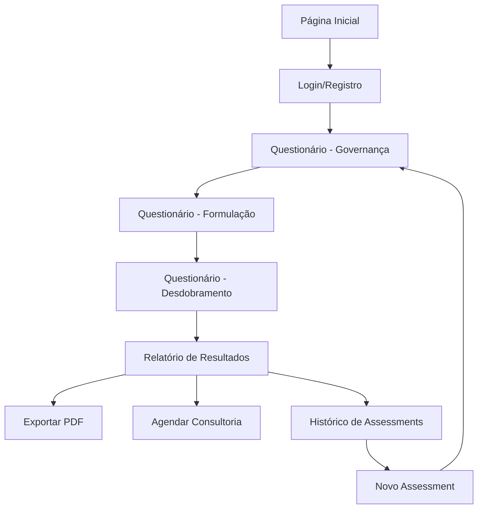

# Ferramenta de Assessment de Maturidade da Gestão da Estratégia - Documento de Requisitos do Produto

## 1. Visão Geral do Produto

A Ferramenta de Assessment de Maturidade da Gestão da Estratégia é uma aplicação web interativa que avalia o nível de maturidade organizacional na gestão estratégica através de três dimensões fundamentais: Governança, Formulação e Desdobramento/Comunicação da Estratégia. A ferramenta gera relatórios personalizados com recomendações acionáveis baseadas na metodologia Stratica, complementando o assessment existente de maturidade digital.

- **Objetivo Principal**: Diagnosticar e orientar organizações no aprimoramento de seus processos de gestão estratégica
- **Público-Alvo**: Executivos, diretores e gestores responsáveis pelo planejamento estratégico organizacional
- **Valor de Mercado**: Posicionar a Stratica como referência em assessment estratégico, expandindo o portfólio de ferramentas de diagnóstico organizacional

## 2. Funcionalidades Principais

### 2.1 Papéis de Usuário

| Papel | Método de Registro | Permissões Principais |
|-------|-------------------|----------------------|
| Usuário Avaliador | Email corporativo | Realizar assessments, visualizar relatórios próprios |
| Administrador | Convite interno | Gerenciar assessments, visualizar todos os relatórios, exportar dados |

### 2.2 Módulos Funcionais

Nossa ferramenta de assessment estratégico consiste nas seguintes páginas principais:

1. **Página Inicial**: apresentação da ferramenta, benefícios do assessment, acesso ao questionário
2. **Questionário Interativo**: formulário estruturado com as três dimensões de avaliação
3. **Relatório de Resultados**: dashboard com scores, gráficos de maturidade e recomendações personalizadas
4. **Histórico de Assessments**: visualização de avaliações anteriores e evolução temporal
5. **Página de Login/Registro**: autenticação de usuários e coleta de dados organizacionais

### 2.3 Detalhes das Páginas

| Nome da Página | Módulo | Descrição da Funcionalidade |
|----------------|--------|-----------------------------|
| Página Inicial | Hero Section | Apresentar valor da ferramenta, estatísticas de uso, botão de início do assessment |
| Página Inicial | Metodologia | Explicar as três dimensões avaliadas, níveis de maturidade, abordagem Stratica |
| Questionário Interativo | Formulário Dinâmico | Apresentar perguntas por dimensão, capturar respostas de múltipla escolha (níveis 1-4), barra de progresso |
| Questionário Interativo | Validação | Garantir completude das respostas, permitir revisão antes da submissão |
| Relatório de Resultados | Dashboard de Scores | Exibir pontuação por dimensão, score geral, gráfico radar de maturidade |
| Relatório de Resultados | Recomendações | Gerar sugestões personalizadas baseadas no nível identificado em cada dimensão |
| Relatório de Resultados | Exportação | Permitir download em PDF, compartilhamento por email |
| Histórico | Lista de Assessments | Mostrar avaliações anteriores com datas, scores e comparações temporais |
| Histórico | Análise de Evolução | Gráficos de tendência, identificação de melhorias e áreas de atenção |
| Login/Registro | Autenticação | Login via email/senha, registro com dados organizacionais (empresa, cargo, setor) |
| Login/Registro | Perfil | Editar informações pessoais e organizacionais, preferências de notificação |

## 3. Processo Principal

### Fluxo do Usuário Avaliador:
1. **Acesso**: Usuário acessa a página inicial e conhece a ferramenta
2. **Registro/Login**: Cria conta ou faz login com credenciais existentes
3. **Questionário**: Responde às perguntas das três dimensões estratégicas
4. **Resultados**: Visualiza dashboard com scores e recomendações personalizadas
5. **Ações**: Exporta relatório, agenda consultoria ou inicia novo assessment

### Fluxo do Administrador:
1. **Dashboard Admin**: Acessa painel com estatísticas gerais de uso
2. **Gestão**: Visualiza todos os assessments, exporta dados agregados
3. **Análise**: Identifica tendências de mercado e oportunidades de negócio

## 4. Design da Interface

### 4.1 Estilo de Design

- **Cores Primárias**: Azul corporativo (#1E40AF), Verde sucesso (#059669)
- **Cores Secundárias**: Cinza neutro (#6B7280), Laranja destaque (#EA580C)
- **Estilo de Botões**: Arredondados com sombra sutil, efeitos hover suaves
- **Tipografia**: Inter (títulos), Open Sans (corpo), tamanhos 16px-24px
- **Layout**: Design limpo baseado em cards, navegação superior fixa
- **Ícones**: Estilo outline minimalista, ícones de estratégia e crescimento

### 4.2 Visão Geral do Design das Páginas

| Nome da Página | Módulo | Elementos de UI |
|----------------|--------|----------------|
| Página Inicial | Hero Section | Banner com gradiente azul, título impactante, CTA proeminente, ilustração de estratégia |
| Página Inicial | Metodologia | Cards explicativos das 3 dimensões, ícones representativos, cores diferenciadas |
| Questionário | Formulário | Layout de uma pergunta por tela, botões de rádio estilizados, barra de progresso animada |
| Relatório | Dashboard | Gráfico radar central, cards de score por dimensão, seção de recomendações com ícones |
| Histórico | Timeline | Lista cronológica com badges de score, gráficos de linha para evolução |

### 4.3 Responsividade

A ferramenta é projetada com abordagem mobile-first, garantindo experiência otimizada em dispositivos móveis e tablets. Inclui otimizações para toque, navegação simplificada em telas menores e adaptação de gráficos para diferentes resoluções.
